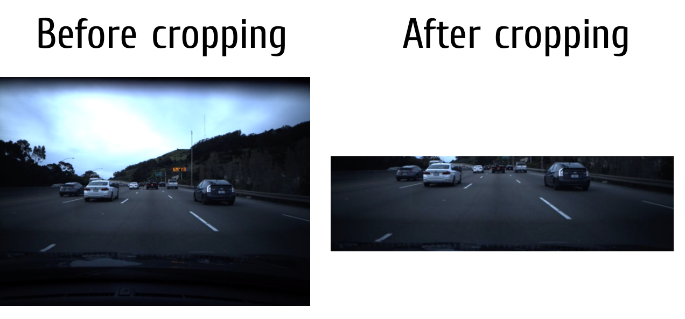
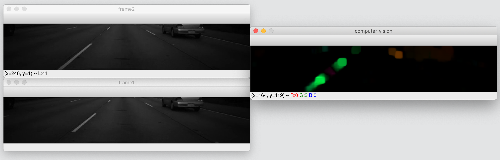
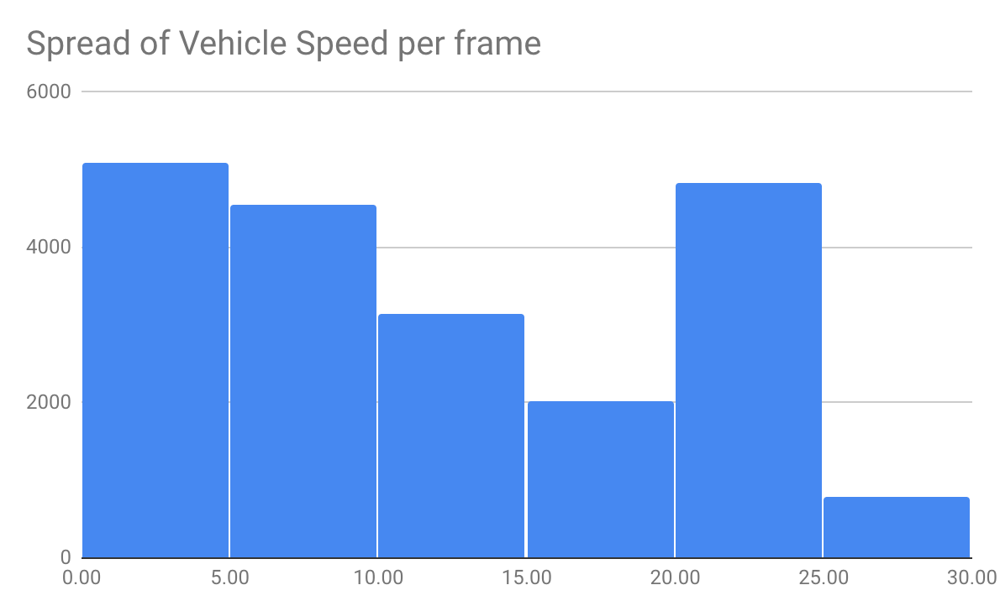
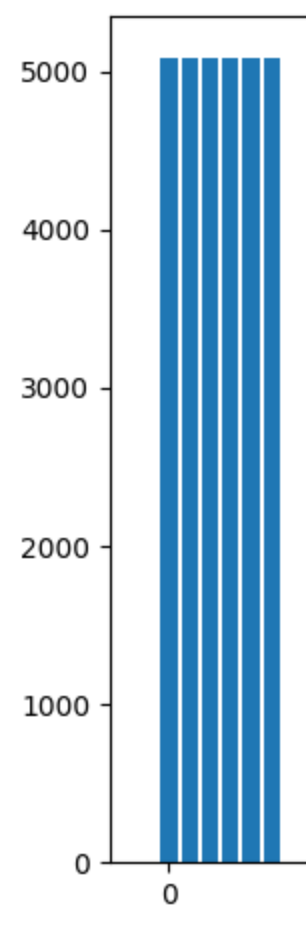

# Frame veloicty estimator using a regression classifation.

This program estimates the velocity of a dash cam video at each subsequent frame.
A regression learning model is made to help train the network on a video with 20400 frames.

# Data Extraction
The data was generated using Gunner Farneback's dense optical-flow algorithim. The previous frame and the current frame was used the generate the data. The dense optical-flow implementation came from OpenCV calcOpticalFlowFarneback function.
Using a sparse optical flow implementation was considered and calcOpticalFlowFarneback was used. Unfortunately, sparse optical flow did not produce good classification results.

Image intensity matching was considered and used. However when having the same matching intensity, the classifier tended to peform worse due to having to much background noise.

Lastly, the video frames were cropped. This decision was made based on the idea that mutch of the data generated without cropping produced noise & classifying signs and mountains, which did not help in modeling the frame velocity.

Once the cropping the done, the regression model improved dramatically from a mean squared error values of 25 to ~10.

# Optical-flow representation
Parameter serach was done for the calcOpticalFlowFareback function. 
The parameters ( 0.5, 5, 15, 3, 7, 1.5, 0) yileded the best results

# Data analysis
Google docs was used to generate the distribution of the velocity data. 
The bins were made in increments of 5. This allows us to have speed groups that range from i < x < i+5.

From the image, we can quickly notice velocity frames with greater than 30 speed were low compared to other speeds. This would go on to affect
the classifcation rate of higher speeding frames.

Oversampling was done to help distribute the data into a more even dataset. This would increase our classification peformance.
The program finds the speed group with the highest number of occurences, and samples all the subsequencet groups appropriately. 

Using pyplot, the distribution of the data was plotted after the oversampling to show that the data was evenly distributed.

# Result analysis
The classifier was ran on 8 epochs, 8 batch size, and learning rate of 0.001

The original data before the oversampled was trained and then tested on the whole dataset at the end. The mean square on average was 2.66

The oversampled dataset slightly lowered the mean-square average to 2.3 on average.
.

# Final touch logic

The model predictions also were given logic.
A lamborghini can go from 0-60 in ~ 3 seconds. That means we can ~change speeds in ~20 seconds. 
in 20 frames, we can really only change speeds by ~1m/s. 

Hence a cutoff was made, where if a prediction for frame was greater velocity than the previous frame by more than 15m/s(And this is being really generous), then the value would be brought down to a more realistic scale by using the previous frame velocity value.

